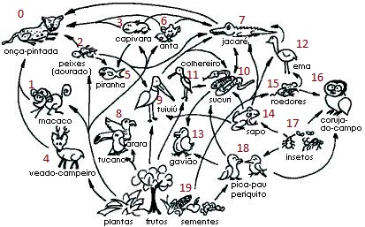
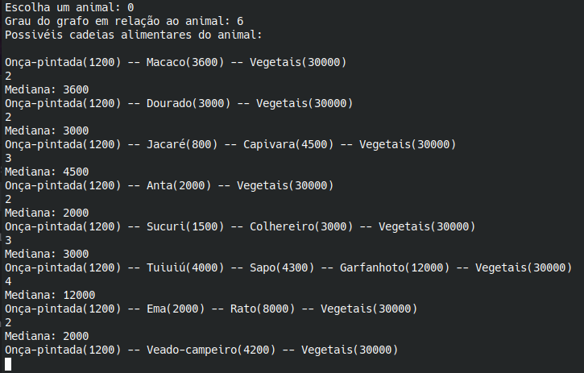

#  Final_FoodWeb_Energy

**Número da Lista**: 24 
**Conteúdo da Disciplina**: Final 

## Alunos
|Matrícula | Aluno |
| -- | -- |
| 18/0117548  |  [Bruno Carmo Nunes](https://github.com/brunocmo) |
| 17/0150747  |  [Marcos Vinícius Rodrigues da Conceição](https://github.com/marcos-mv) |

## Video

https://www.youtube.com/watch?v=BWAUWcVLbGYs

## Sobre

O projeto visa na aplicação do algoritmo de grafos (dfs) para encontrar os possíveis caminhos de uma teia alimentar, e também como análise, mostra a mediana das medianas em relação a sua biomassa da biosfera dessa teia.

## Screenshots

## 

## 

## Instalação
**Linguagem**: C++ 

Feito e usado no kernel: **GNU/Linux 6.1.1-arch1-1 x86_64**

Tenha o *git*, *make* e o compilador *c++* versão C++11 instalado na sua maquina.
De preferência, para não ocorrer problemas, use o Ubuntu.

Para clonar:

`git clone https://github.com/projeto-de-algoritmos/Final_FoodWeb_Energy.git`

Para compilar o programa:

`make`

Para executar o programa:

`make run`

Para limpar os arquivos .o e bin do programa:

`make clean`

## Uso

Depois de rodar o programa, escolha um animal de 0 - 19 (de acordo com a foto), e escolha o pivo para obter o mediana da biomassa. E depois pressione ENTER para rodar novamente.

## Outros
Quando executar o programa no CLI, use-o em tela cheia para melhor aproveitamento do mesmo.

